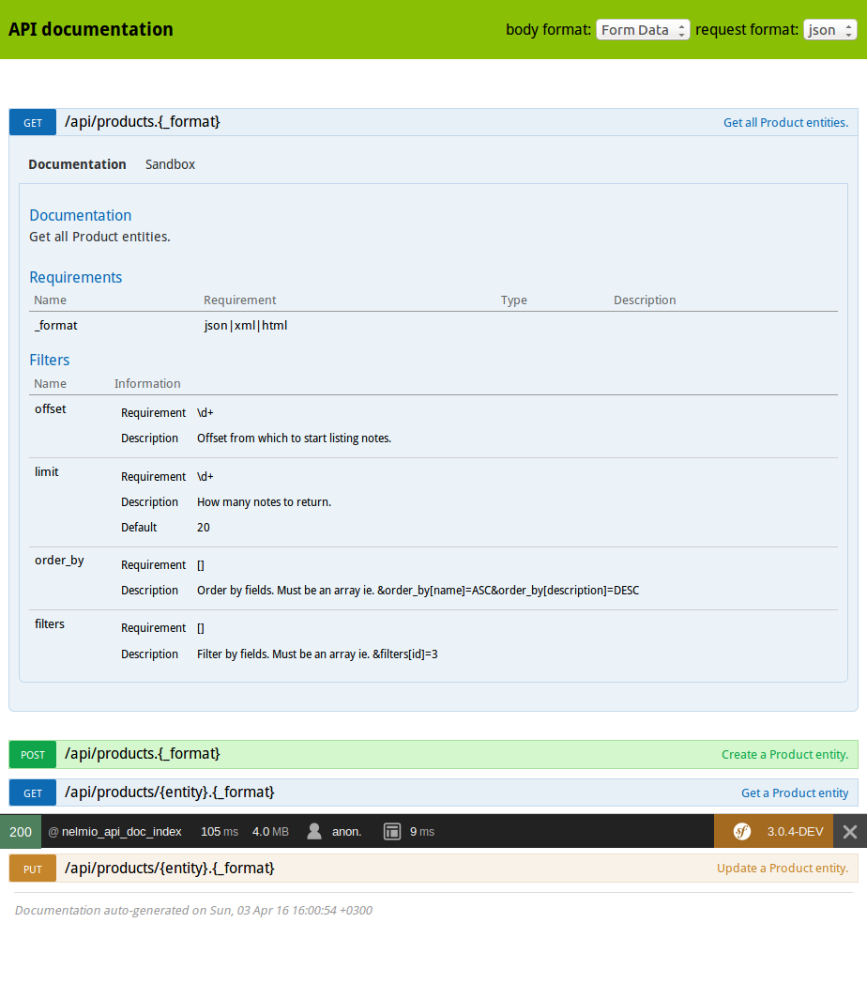
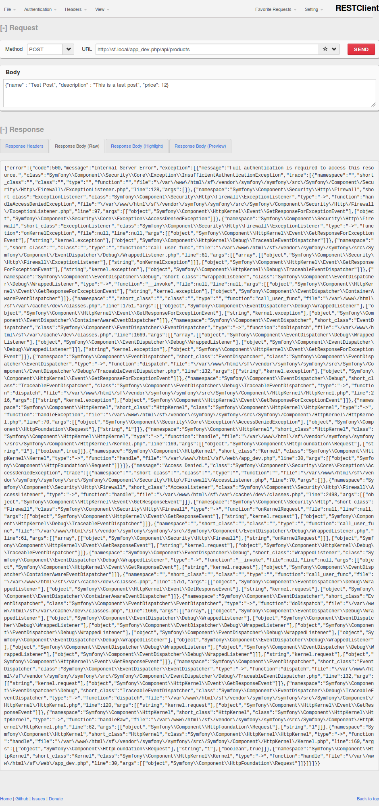

Example of Symfony3 project
===========================

## How to install

1. Clone this repository `git clone git@github.com:Qeti/Karika.git`
1. Install dependencies and setup local environment: `composer install`
1. Create database manually with PostgreSQL or with command: `php bin/console doctrine:database:create`
1. Create database schema with command: `php bin/console doctrine:schema:create`
1. Setup web server (root directory is `web`)
1. Open url <karika_url>/api/doc to view methods description.

## Api documentation

## Get method of REST API

## Access control for POST

